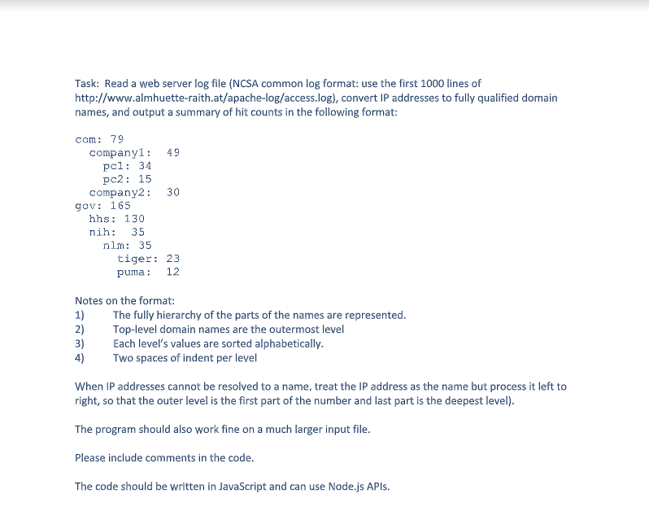

# ip-to-domain

### Introduction

The utility was written as part of a technical test for a developer position
with National Institutes of Health (NIH).  `ip-to-domain` software was built
just to meet the requirements of the exercise.  In crafting the code some of the
best practices were followed; however, this project is provided for educational
purposes only.

### Technical Exercise Description



### Usage

**Note:** On par with below instruction, a suite of tests located in the `test`
folder can also be used as documentation for using the utility.

1. Install the package directly from GitHub:

```
npm install git+ssh://git@github.com:aptivator/ip-to-domain.git
```

2. Include the utility in the code:

```javascript
const path       = require('path');
const ipToDomain = require('ip-to-domain');
```

3. Use the utility as follows:

```javascript
//path to the file with logs
let logFile = path.resolve(__dirname, '<path to log file>');

//RegEx to extract values (as array) from each line
let recordRx = /(?:"[^"]+")|(?:\[[^\]]+\])|(?:[^\s]+)/g; 

//index of the extracted array pointing to the ip address
let ipIndex = 0; 

//maximum number of concurrent lookups to perform
let concurrentLookups = 20; 

//for hierarchical text report use "text"
//for JSON use "json"
//or, for regular JavaScript object use "object"
let format = 'text'; 

ipToDomain(logFile, recordRx, ipIndex, concurrentLookups, format).then(report => {
  //do something with the report
});
```

### Development

The project comes with basic testing scaffolding.  In development mode, the 
tests are run anytime `src` or `test` folder files are changed.  

The mode can be launched with the below command. (**Note:** make sure that
all dependcies are installed in the cloned repository by running `npm install`).

```
npm run dev
```

To see how well the tests cover the code, execute this instruction:

```
npm run test:coverage
```
